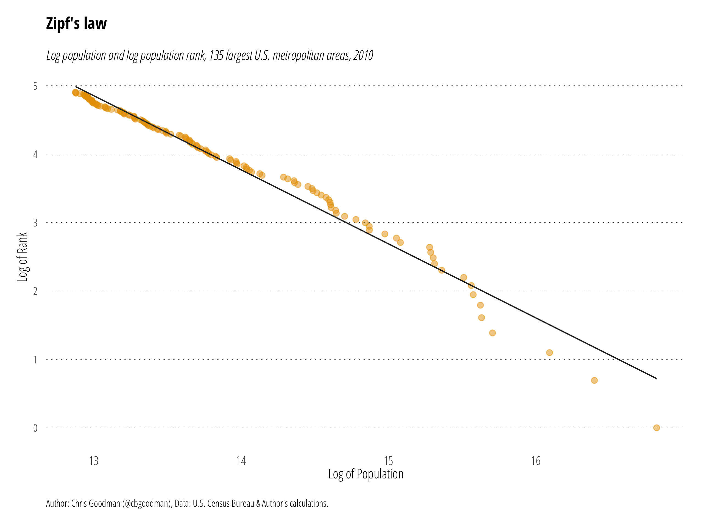
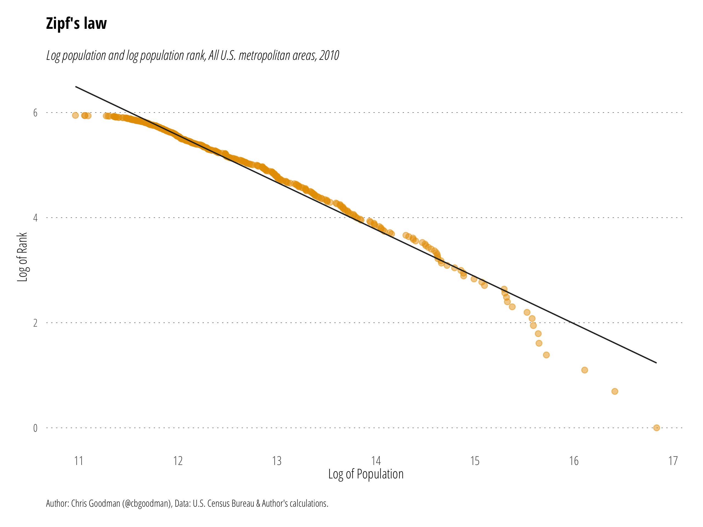

# Zipf's Law

The **R** script `zipfs-law.r` reads `msapop.csv` to create the images below of Zipf's Law for U.S. Metropolitan areas in 2010. Population data is from the 2010 U.S. Census.

### 135 Largest Metropolitan Areas

### All Metropolitan Areas

